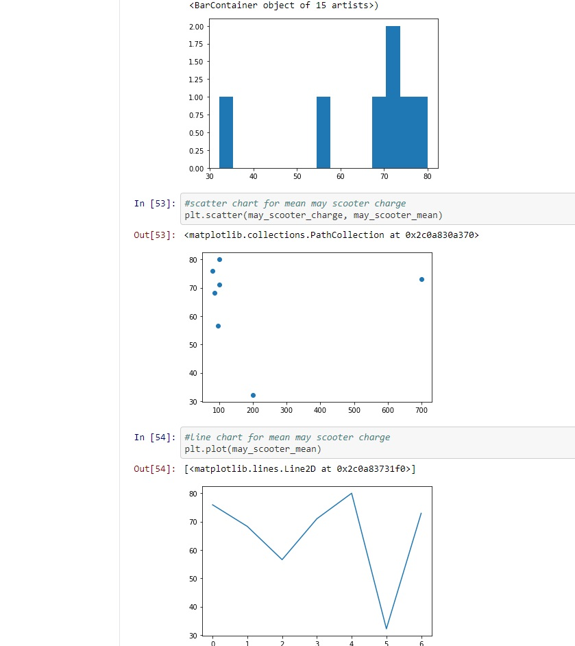
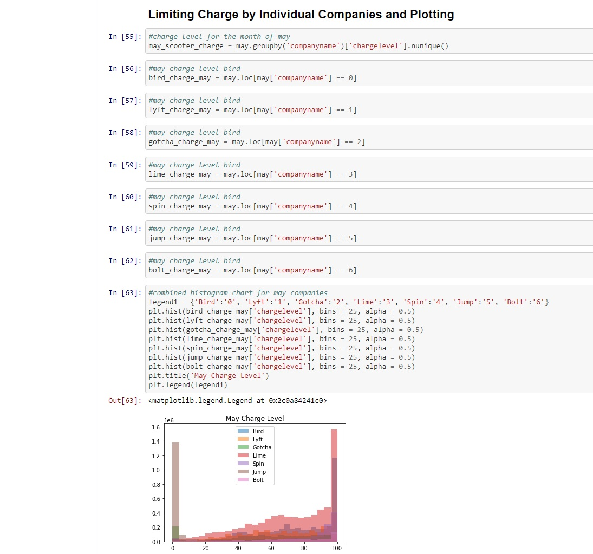
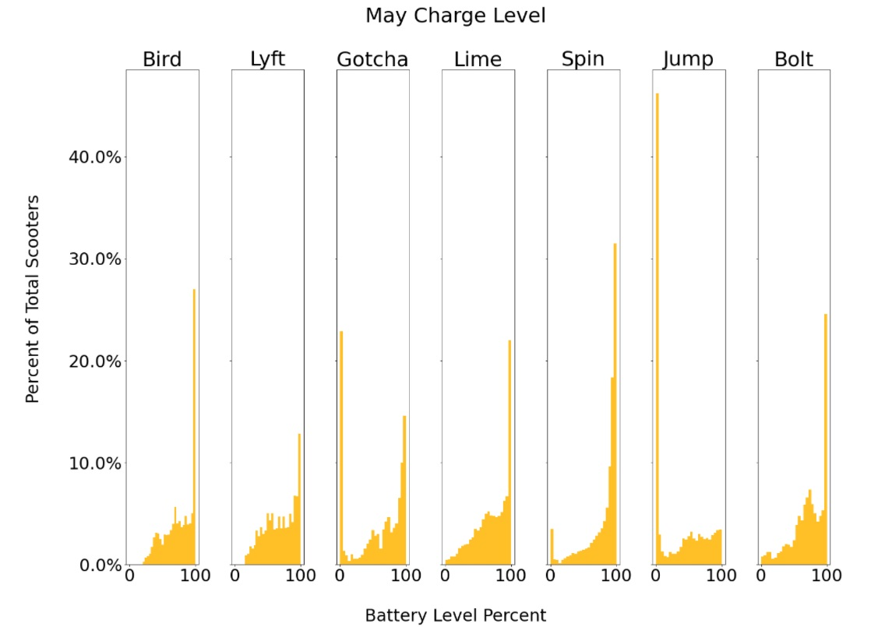

# nashville-scooters-project

# Introduction
For this project, our team was asssigned with finding the idea density of scooters for the Nashville Metro area. Three rides (of 3 meters or more) per day per scooter is the baseline for ridership goals. For this project, our team used Python for data analysis and Powerpoint for presenting our findings.

I was assigned with finding and visualizing the charge levels of all scooters broken out by company, for each month covered in the dataset. There were a total of seven companies in the dataset.

Data Sources: All data for the project was provided by NSS
# Table of Contents
* [Introduction](#Introduction)
* [Python Walkthrough](#Python-Walkthrough)
* [Presentation](#Presentation)

# Python Walkthrough
1. The first step in the project is to install all the necessary packages using `import`

2. The second step is to read in all the files needed for the project using `pd.read_pickle` and `pd.read_csv`

3. Throughout this step, I explored the data by checking the dataframe structure and column datatypes along with using `.nunique`, `.groupby`, `.isnull`, and `.value_counts` to find null values and unique ids for each company

4. The fourth step involved making aliases for each month and grouping the data by company and charge level to find out what companies had the most charged scooters over each of the three months

5. During this step, I experiment with different charts I can use to visualize the scooter charges for each company

6. In this step, I break out each company into a separate dataframe for each month using `.loc` and plot a histogram, but it seems to be too cluttered

7. After some experimentation, I found a way to plot every company by scooter charge level for each month, with the y-axis showing the percentage of all scooters by company, and the x-axis showing the battery level percent of all scooters by company

# PowerPoint Presentation
[PowerPoint Presentation](presentation/nashville_scooter_presentation.pdf)